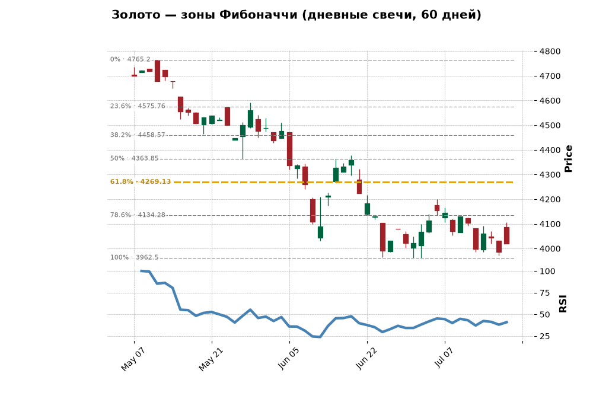

# Бот металлов — зоны Фибоначчи

Telegram-бот: свечные графики золота, серебра, меди, алюминия и нефти Brent с уровнями коррекции Фибоначчи и RSI(14). Таймфреймы — кнопками под графиком: 15м / 30м / 1ч / 4ч / день / неделя (по умолчанию день; 4ч склеивается из часовых свечей). Уровни пересчитываются под выбранный таймфрейм, а окно свинга — своё для каждого (от ~2 дней на 15м до ~2 месяцев на дне), чтобы сетка отражала реально значимый свинг, а не случайный кусок внутри суток. По кнопке или ежедневным дайджестом присылает PNG-график — каждый уровень подписан прямо на линии — и аккуратную сводку уровней с пометкой ближайшего и «в зоне» (цена ближе 1% к уровню). Копит собственную статистику: как цена вела себя после каждого сигнала (`/stats`).

Навигация: постоянная клавиатура внизу (Графики / Статистика / Помощь), кнопки «График» и «Меню» под каждым алертом, справка по разделам (уровни Фибоначчи, как читать статистику, как пользоваться ботом). На любое текстовое сообщение бот отвечает навигацией, команды /start и /stats зарегистрированы в системном меню Telegram.

Не финансовый совет — сырые уровни цены, решение принимает человек. Полный доступ — у админов (`ADMIN_IDS`) и подписчиков: оплата через Telegram Stars (`STARS_PRICE` за `SUB_DAYS` дней, платёжный провайдер не нужен). Админ может подарить подписку командой `/gift [дней]` — бот выдаёт одноразовую ссылку, подписка активируется у первого, кто по ней перейдёт.



Плюс алерты в реальном времени: раз в `ALERT_INTERVAL_MIN` минут (по умолчанию 30) бот проверяет цены и присылает сообщение, когда цена входит в зону Фибоначчи (ближе 1% к уровню). Один алерт на инструмент+уровень в день, история — в SQLite `metals.db`, и опционально каждая строка выгружается в Google-таблицу (`sheets.py`) — там ведётся аналитика, сколько раз уровни отработали.

Также ищет дивергенции RSI/цена (классические и скрытые, бычьи и медвежьи) — рисует линию прямо на графике (на цене и на RSI) и подписывает под ним, упоминает в алертах, если совпали с зоной Фибоначчи.

Каждый алерт записывается с контекстом (RSI, ATR, дивергенция, версия алгоритма), а раз в сутки бот дописывает, куда цена ушла через 1/3/7 дней. Так копится собственная статистика отработки уровней — команда `/stats` показывает среднее движение цены после входа в зону по каждому инструменту и уровню. Скачанные цены кэшируются на `CACHE_TTL_MINUTES` минут (по умолчанию 10), чтобы дайджест и алерты не ходили в Yahoo за одним и тем же.

```
yfinance (Yahoo, бесплатно)
        |
   signals.py ── fetch_prices (ретраи + кэш CACHE_TTL_MINUTES),
        |         compute_fib_zones, compute_indicators (RSI/ATR)
   chart.py ──── свечи + Фибоначчи + RSI → PNG (mplfinance)
   captions.py ─ текст подписей, алертов и сводки /stats
        |
   bot.py ────── aiogram: меню, дайджест (DIGEST_HOUR, DIGEST_TZ),
        |         алерт-цикл (ALERT_INTERVAL_MIN), /stats,
        |         дозапись результатов сигналов раз в сутки
   history.py ── SQLite metals.db: дедупликация, история алертов
                 с контекстом (RSI, ATR, версия алгоритма)
                 и ценой через 1/3/7 дней после сигнала
```

## Запуск

```bash
python3.12 -m venv venv && source venv/bin/activate   # именно 3.12: pandas-ta/numba не работают на 3.14
pip install -r requirements.txt -r requirements-dev.txt
cp .env.example .env   # заполнить BOT_TOKEN, ADMIN_IDS
python3 bot.py
```

Тесты: `pytest`.

Docker (для сервера): `docker compose up -d --build` — рестарт автоматический, база алертов в `./data/`.

Автозапуск на macOS — LaunchAgent `com.roger.metals-bot.plist` (см. `deploy/`), поднимает бота после перезагрузки и падений. Лог — `~/Library/Logs/metals-bot.log` (в папку Desktop launchd писать не может из-за TCC-защиты macOS).

## Ограничения

- Без платных API: данные yfinance, индикаторы локально (pandas-ta), без TradingView (их ToS запрещает прямой сбор данных).
- История проекта: репозиторий начинался как «радар потребностей» (сбор болей из RSS/Telegram) — идея заморожена и вынесена в `../radar-idey/ПЛАН.md`.
